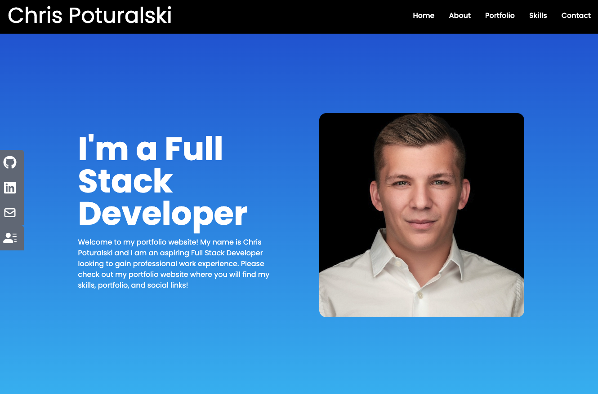

# Portfolio Website

## Table of Contents

- [Description](#description)
- [Deployments](#deployments)
- [Screenshot](#screenshot)
- [Questions](#questions)

## Description

Welcome to my React Portfolio that I had created using ReactJs and Tailwind CSS. In this portfolio, I was able to create a nav bar, home page, about page, portfolio, skills, contact, and then a side bar showing my social media links along with my resume.

Technologies that were used in this application were React Icons, React Scroll and then Tailwind CSS features throughout the project.

## Screenshot

## Deployment

https://intense-headland-51020.herokuapp.com/

## Questions

For questions, please email me at chrispoturalski0689@gmail.com or follow my Github profile @chrispoturalski

